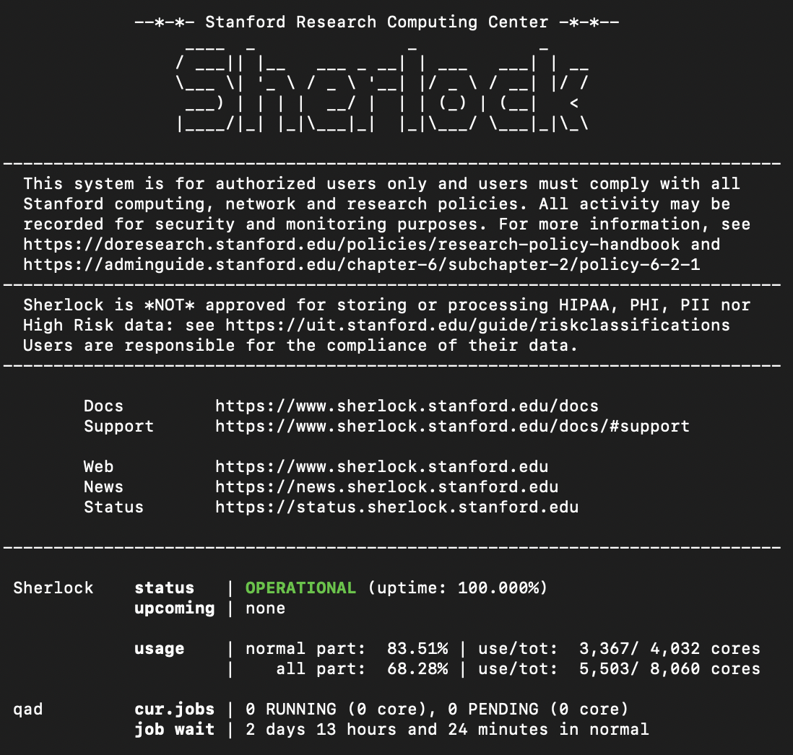
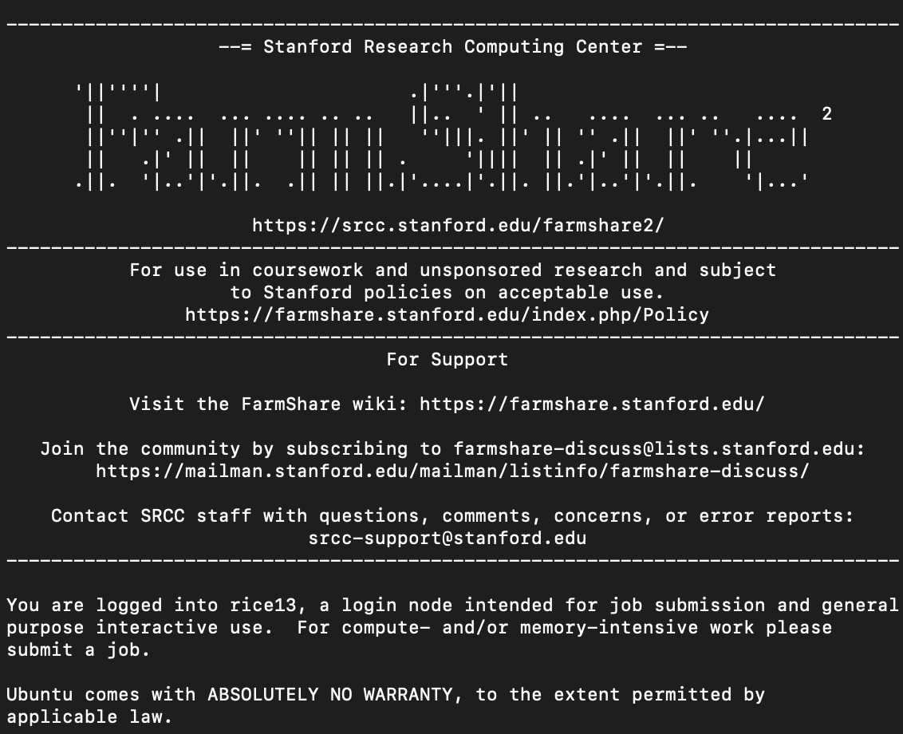

# Logging in
The exact login procedure for HPC systems varies between institutions; check the documentation from your local Research Computing group for details. Two-factor authentication is widely used for HPC systems, so keep your phone on hand.

## What happens once you're in?
When you log into an HPC cluster, there's often some kind of policy reminder (so you can't claim you didn't see it), and maybe a set of relevant documentation links.

Then there's usually some kind of system status message: is the system working? How busy is it? How many jobs do you currently have running?

Don't worry too much about the *job wait* time you might see: in reality, your wait time will depend on lots of different factors, including how many resources you're requesting. 

## Login node
HPC systems aren't set up like big cloud servers where you can just log in and start your computational analysis: when you log in, you're accessing a special server called a *login node*, which isn't designed for computation. It's more like a train station: it won't take you anywhere, but it's a space where you can double-check you have everything in your luggage (your files), generally get ready (install software), then catch a train to where you want to go (submit a job).

Don't try to run computational jobs on the login node. You'll probably either get an error message or an email from the sysadmin.

## 🌲 Logging into Sherlock
If a faculty member has already requested an account for you on Sherlock (see [Getting access](getting-access)), you can connect to it by opening a command line (on a Mac, go to *Applications > Utilities > Terminal*; on Windows, search for *Command Prompt*) and typing `ssh your-sunet-id@sherlock.stanford.edu` (replacing **your-sunet-id** with your actual SUNet ID). Some text will pop up asking how you want to do two-factor authentication; choose an option and once you successfully authenticate, you'll be logged into the login node on Sherlock.

## 🌲 Logging into Farmshare
If you don't have access to Sherlock, you can log into Farmshare by opening a command line (on a Mac, go to *Applications > Utilities > Terminal*; on Windows, search for *Command Prompt*) and typing `ssh your-sunet-id@rice.stanford.edu` (replacing **your-sunet-id** with your actual SUNet ID).

